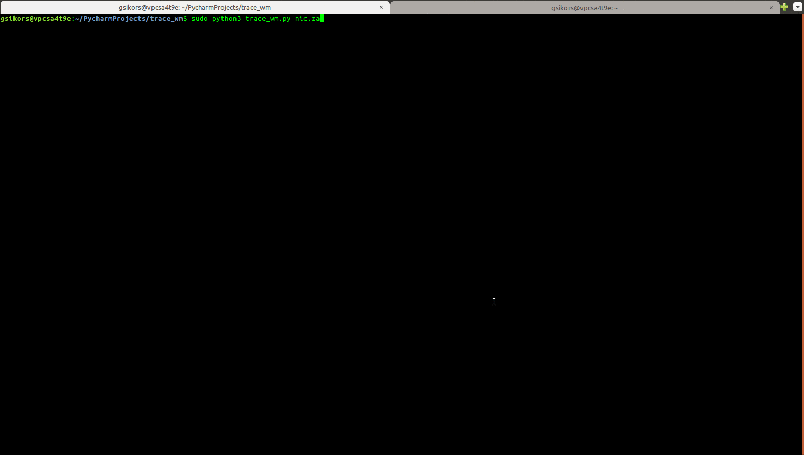

# trace_wm
Works like simple traceroute utility in linux console, but additionally prints ascii world map
and displays geo location points.

To install dependencies:
sudo pip install -r requirements.txt
or
sudo pip3 install -r requirements3.txt
